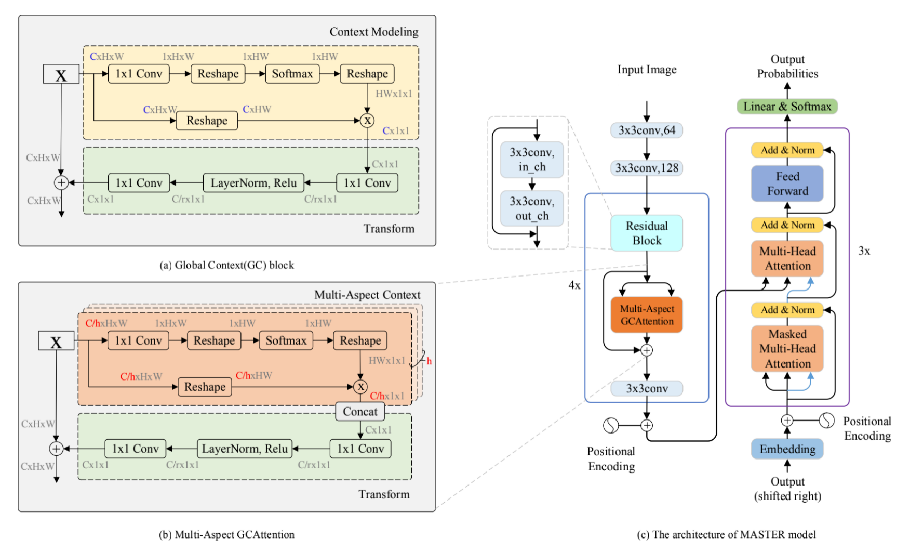
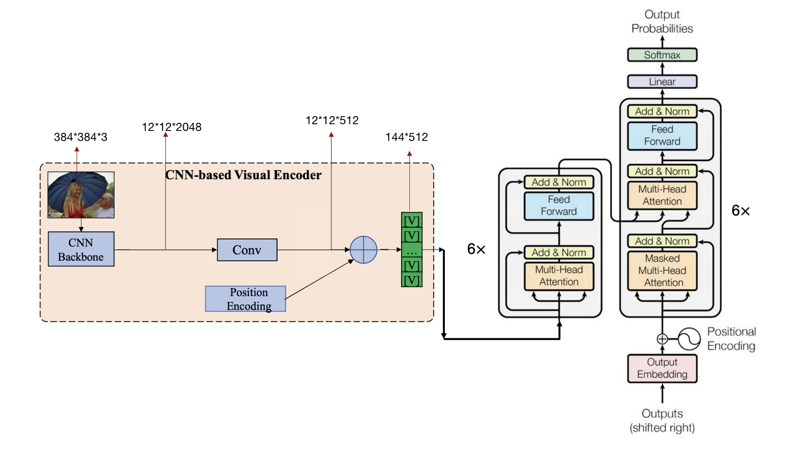
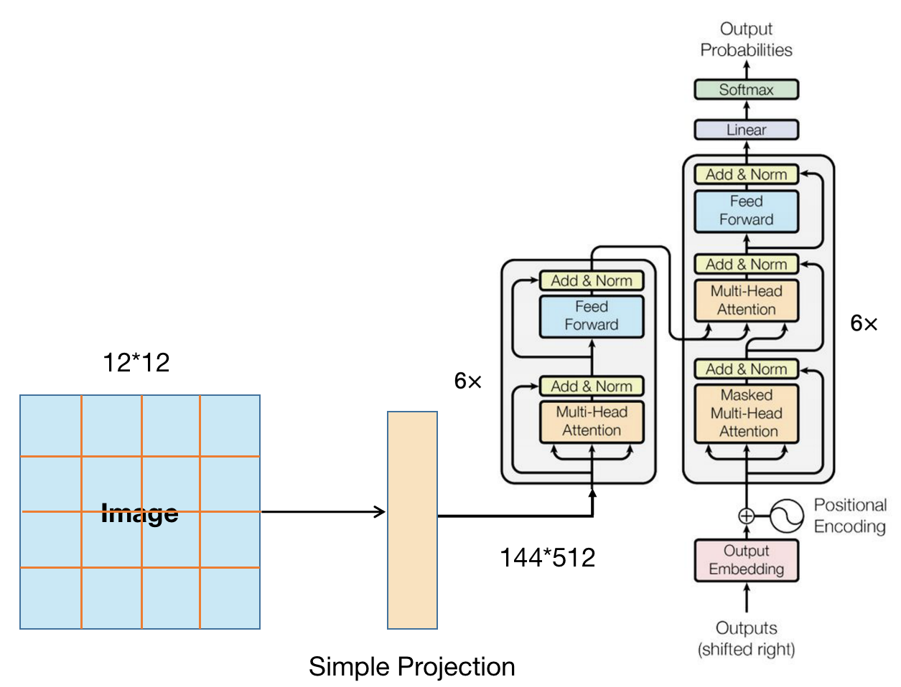

  <h1 align="left">Image2Caption 项目</h1>


<!-- TABLE OF CONTENTS -->

<details open="open">
  <summary><h2 style="display: inline-block">目录</h2></summary>
  <ol>
    <li>
      <a href="# 关于本项目">关于本项目</a>
      <ul>
        <li><a href="####模型">模型</a></li>
        <li><a href="# 环境依赖">环境依赖</a></li>
      </ul>
    </li>
    <li>
      <a href="#快速开始">快速开始</a>
      <ul>
        <li><a href="#先决条件">数据集下载</a></li>
        <li><a href="#安装">环境安装</a></li>
      </ul>
    </li>
    <li>
      <a href="##使用方法">使用方法</a>
      <ul>
        <li><a href="#训练">训练</a></li>
        <li><a href="#测试<">测试</a></li>
        <li><a href="#计算BLEU得分">计算BLEU得分</a></li>
      </ul>
     </li>
    <li><a href="#结果">结果</a></li>
    <li><a href="#pretrained-model">Pretrained model</a></li>
  </ol>
</details>


<!-- 关于本项目 -->

## 关于本项目
本项目是视觉与语言课程的期末课程作业，任务目标是ImageCaptioning任务。使用的数据集是2017年的AI Challenger中文Image Captioning数据集。


### 模型
在本项目中，使用的是典型的Encoder-Decoder模型

#### 模型1:
- Encoder: 带Global Context(GC) Block的ResNet-31
- Decoder: 3层Transformer Decoder

网络结构为:



#### 模型2:
- Encoder: 带 Global Context(GC) Block 的ResNet-50 + 
6层Transformer Encoder
- Decoder: 6层Transformer Decoder。

具体使用的网络架构见下图所示:



#### 模型3:
除此之外，受到ViT模型的启发，也可以直接使用Transformer模型进行图片到序列的翻译任务
- Encoder: 图片patch线性投影+6层Transformer Encoder
- Decoder: 6层Transformer Decoder

网络架构:  




### 环境依赖

本项目主要需要如下的环境依赖，具体安装方式见快速开始！
* [torch-1.10.0+cu113](https://pytorch.org/get-started/locally/)
* [MMOCR-0.2.0](https://github.com/open-mmlab/mmocr/tree/v0.2.0)
* [MMDetection-2.11.0](https://github.com/open-mmlab/mmdetection/tree/v2.11.0)
* [mmcv-full-1.4.0](https://github.com/open-mmlab/mmcv/tree/v1.4.0)


<!-- 环境安装 -->

## 快速开始

### 数据集下载

+ 直接下载预处理好的数据, 点击下载 [here](https://disk.pku.edu.cn:443/link/86CD35B498D7AC30BA40E565F82B1EED)，解压到与该项目同级的别的文件夹内，需要使用合并解压，命令示例：
```sh
zip sub_chinese_caption.zip -s=0 --out chinese_caption.zip
# 解压chinese_caption.zip
unzip chinese_caption.zip
```
解压之后的文件目录结构应该为
```sh
.
├── Master_im2caption
│   
└── im2caption_data
    └── chinese_caption
         ├── ai_challenger_caption_test_a_20180103
         │   └── caption_test_a_images_20180103
         ├── ai_challenger_caption_test_b_20180103
         │   └── caption_test_b_images_20180103
         ├── ai_challenger_caption_train_20170902
         │   └── caption_train_images_20170902
         └── ai_challenger_caption_validation_20170910
            └── caption_validation_images_20170910

```
### 环境安装

1. 创建新环境
   ```sh
   conda create -n im2caption python=3.7
   conda activate im2caption
   # 安装nltk
   pip install nltk
   ```

2. 安装torch1.10.0+cu113
   ```sh
   # install torch1.10.0+cu113
   pip3 install torch==1.10.1+cu113 torchvision==0.11.2+cu113 torchaudio==0.10.1+cu113 -f https://download.pytorch.org/whl/cu113/torch_stable.html
   ```

3. 安装 mmcv-full-1.4.0。点击 [here](https://github.com/open-mmlab/mmcv) 查看更多细节。

   ```sh
   # install mmcv-full-1.4.0 with torch version 1.10.0 cuda_version 11.3
   pip install mmcv-full==1.4.0 -f https://download.openmmlab.com/mmcv/dist/cu113/torch1.10.0/index.html
   ```
   如果遇到网络问题无法下载，可选择手动下载mmcv1.4.0[安装包](https://disk.pku.edu.cn:443/link/B08D90D89CA352CCBB99D40E9B0E7A0E)，选择合适的版本进行安装，示例安装命令：
   ```sh
   pip install mmcv_full-1.4.0-cp38-cp38-manylinux1_x86_64.whl
   ```
   
4. 确保在项目文件夹下(Master-im2caption)，安装 mmdetection。点击 [here](https://github.com/open-mmlab/mmdetection/blob/v2.11.0/docs/get_started.md) 查看更多细节。
   
   ```sh
   # We embed mmdetection-2.11.0 source code into this project.
   # You can cd and install it (recommend).
   cd ./mmdetection-2.11.0
   pip install -v -e .
   ```
   
5. 安装mmocr. 点击[here](https://github.com/open-mmlab/mmocr/blob/main/docs/install.md) 查看更多细节。

   ```sh
   # install mmocr
   cd {Path to Master-im2caption}
   pip install -v -e .
   ```


<!-- USAGE EXAMPLES -->

## 使用方法

### 训练

1. ResNet31withGCB + 3\*Transformer Decoder
   ```shell
   sh im2caption/im2caption_resnet31withGCB.sh
   ```

   训练过程中的日志文件和checkpoint将会保存在 [expr_result/im2caption_chinese_res31withgcb](expr_result/im2caption_chinese_res31withgcb) 中

   默认使用2张gpu进行训练，若使用单卡，修改[im2caption/im2caption_resnet31withGCB.sh](im2caption/im2caption_resnet31withGCB.sh)文件内容如下
   ```shell
   CUDA_VISIBLE_DEVICES=0 PORT=29500 ./tools/dist_train.sh ./configs/textrecog/master/master_Resnet31_withGCB.py expr_result/im2caption_chinese_res31withgcb/ 1
   ```

2. ResNet50withGCB + 6\*Transformer Encoder + 6\*Transformer Decoder

   ```shell
   sh im2caption/im2caption_resnet50withGCB.sh
   ```

   训练过程中的日志文件和checkpoint将会保存在 [expr_result/im2caption_chinese_res50withgcb](expr_result/im2caption_chinese_res50withgcb) 中

   默认使用2张gpu进行训练，若使用单卡，修改[im2caption/im2caption_resnet50withGCB.sh](im2caption/im2caption_resnet50withGCB.sh)文件内容如下
   ```shell
   CUDA_VISIBLE_DEVICES=0 PORT=29500 ./tools/dist_train.sh ./configs/textrecog/master/master_Resnet50_withGCB_TFencoder.py expr_result/im2caption_chinese_res50withgcb/ 1
   ```

3. 图片patch简单线性投影 + 6\*Transformer Encoder + 6\*Transformer Decoder
   ```shell
   sh im2caption/im2caption_transformer.sh
   ```

   训练过程中的日志文件和checkpoint将会保存在 [expr_result/im2caption_chinese_transformer](expr_result/im2caption_chinese_transformer) 中

   默认使用2张gpu进行训练，若使用单卡，修改[im2caption/im2caption_transformer.sh](im2caption/im2caption_transformer.sh)文件内容如下
   ```shell
   CUDA_VISIBLE_DEVICES=0 PORT=29500 ./tools/dist_train.sh ./configs/textrecog/master/im2caption_transformer.py expr_result/im2caption_chinese_transformer/ 1
   ```

### 预测

1. ResNet31withGCB + 3\*Transformer Decoder

   ```shell
   sh im2caption/im2caption_resnet31withGCB_infer.sh
   ```

   预测结果在[expr_result/im2caption_chinese_res31withgcb/predict](expr_result/im2caption_chinese_res31withgcb/predict)中
2. ResNet50withGCB + 6\*Transformer Encoder + 6\*Transformer Decoder

   ```shell
   sh im2caption/im2caption_resnet50withGCB_infer.sh
   ```

   预测结果在[expr_result/im2caption_chinese_res50withgcb/predict](expr_result/im2caption_chinese_res50withgcb/predict)中
3. 图片patch简单线性投影 + 6\*Transformer Encoder + 6\*Transformer Decoder
   ```shell
   sh im2caption/im2caption_transformer_infer.sh
   ```

   预测结果在[expr_result/im2caption_chinese_transformer/predict](expr_result/im2caption_chinese_transformer/predict)中


### 计算BLEU得分

1. 计算验证集上的BLEU得分，注意需要修改[脚本](im2caption/compute_score.py)中的prediction_file和gt_file
   ```shell
   python im2caption/compute_score.py
   ```
2. 预测结果可视化, 注意修改prediction_file

   [im2caption/prediction_visualization.ipynb](im2caption/prediction_visualization.ipynb)
   

<!-- Result -->

## 结果

**这里是3个模型在验证集(3000张图片)上的BLEU@4得分**

|                         Models                                   |    BLEU@4    |
| :-----------------------------------------------------:            | :--------: |
|       ResNet31withGCB + 3\*Transformer Decoder                    |   0.5597   |
| ResNet50withGCB + 6\*Transformer Encoder + 6\*Transformer Decoder |     **0.5821**     |
| 图片patch简单线性投影 + 6\*Transformer Encoder + 6\*Transformer Decoder |   0.2973   |


<!-- Pretrain Model -->

## Pretrained Model
coming soon...


